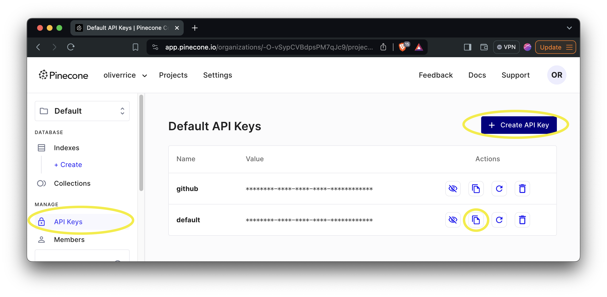
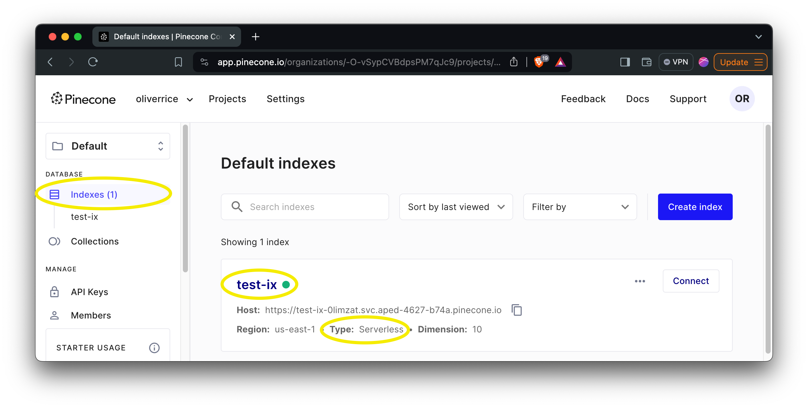
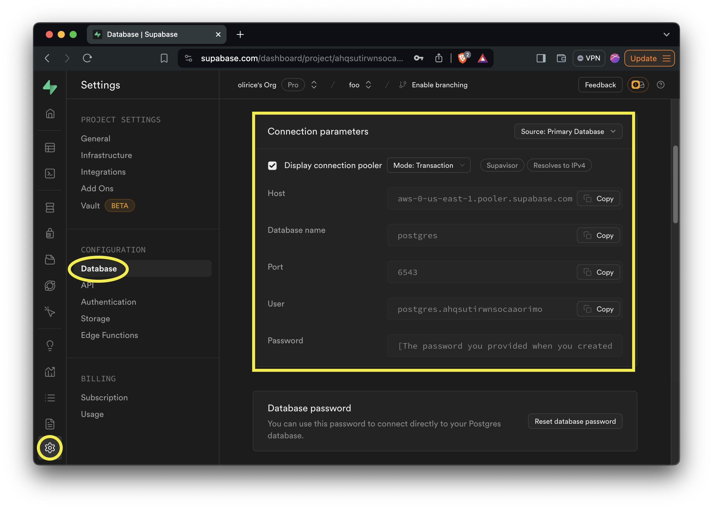
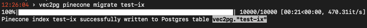
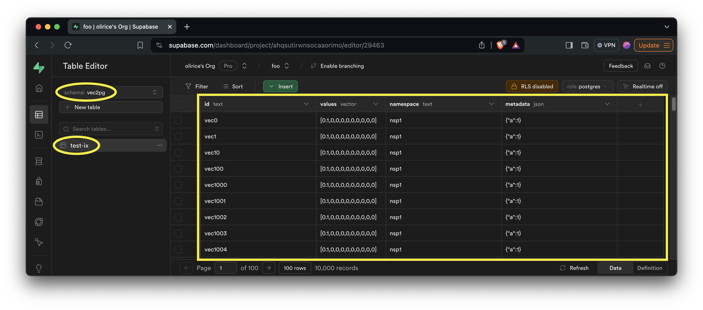

Pinecone is a closed source vector database with "classic" and "serverless" collection types. Classic collections do not support iterating over all records in a collection. For that reason, `vec2pg` exclusively supports migrating from their more recent "serverless" collections.

```
vec2pg pinecone migrate --help
```

```
 Usage: vec2pg pinecone migrate [OPTIONS] PINECONE_INDEX PINECONE_API_KEY                                                                      
                                POSTGRES_CONNECTION_STRING                                                                                    
                                                                                                                                              
╭─ Arguments ──────────────────────────────────────────────────────────────────────────────────────────────────╮
│ *    pinecone_index                  TEXT  [default: None] [required]                                        │
│ *    pinecone_api_key                TEXT  [env var: PINECONE_API_KEY] [default: None] [required]            │
│ *    postgres_connection_string      TEXT  [env var: POSTGRES_CONNECTION_STRING] [default: None] [required]  │
╰──────────────────────────────────────────────────────────────────────────────────────────────────────────────╯
╭─ Options ────────────────────────────────────────────────────────────────────────────────────────────────────╮
│ --help          Show this message and exit.                                                                  │
╰──────────────────────────────────────────────────────────────────────────────────────────────────────────────╯
```


To migrate from [Pinecone serverless](https://www.pinecone.io/blog/serverless/) index to Postgres you'll need:  

- A Pinecone API Key



- The Pinecone serverless index name



- A Supabase instance

From the Supabase instance, we need the connection parameters. Retrieve them on the [database settings page](https://supabase.com/dashboard/project/_/settings/database)



And substitute those values into a valid Postgres connection string
```
postgresql://<User>:<Password>@<Host>:<Port>/postgres
```
e.g.
```
postgresql://postgres.ahqsutirwnsocaaorimo:<Password>@aws-0-us-east-1.pooler.supabase.com:6543/postgres
```

Then we can call `vec2pg pinecone migrate` passing our values. You can supply all parameters directly to the CLI, but its a good idea to pass the Pinecone API Key `PINECONE_API_KEY` and Supabase connection string `POSTGRES_CONNECTION_STRING` as environment variables to avoid logging credentials to your shell's history.



The CLI provides a progress bar to monitor the migration.

On completion, you can view a copy of the Pinecone index data in Supabase Postgres at `vec2pg.<pinecone index name>`



From there you can transform and manipulate the data in Postgres using SQL.


