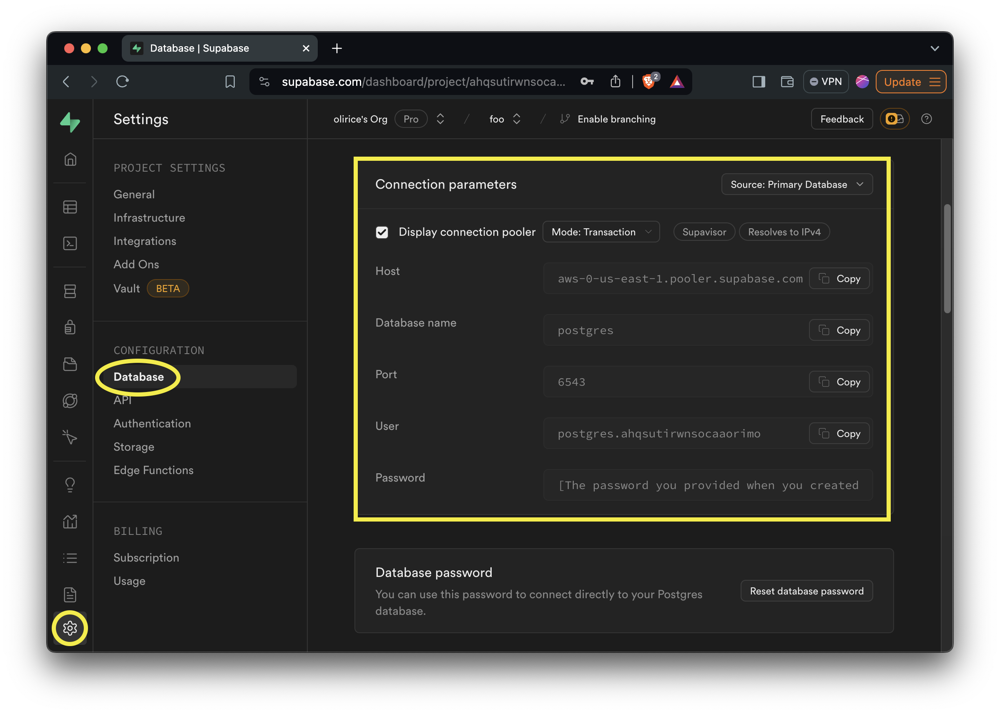

Qdrant is an open source vector database written in python. It can be run in memory, locally via Docker, or as a hosted offering. `vec2pg` supports migrating Qdrant collections from Docker or the hosted platform.

```
vec2pg qdrant migrate --help
```

```
 Usage: vec2pg qdrant migrate [OPTIONS] QDRANT_COLLECTION_NAME QDRANT_URL
                              QDRANT_API_KEY POSTGRES_CONNECTION_STRING 

╭─ Arguments ──────────────────────────────────────────────────────────────────────────────────────────────────╮
│ *    qdrant_collection_name          TEXT  [default: None] [required]                                        │
│ *    qdrant_url                      TEXT  [default: None] [required]                                        │
│ *    qdrant_api_key                  TEXT  [env var: QDRANT_API_KEY] [default: None] [required]              │
│ *    postgres_connection_string      TEXT  [env var: POSTGRES_CONNECTION_STRING] [default: None] [required]  │
╰──────────────────────────────────────────────────────────────────────────────────────────────────────────────╯
╭─ Options ────────────────────────────────────────────────────────────────────────────────────────────────────╮
│ --help          Show this message and exit.                                                                  │
╰──────────────────────────────────────────────────────────────────────────────────────────────────────────────╯
```

To migrate from a Qdrant collection to Postgres you'll need to log in at https://cloud.qdrant.io/ and collect your:  

- Qdrant API Key


- Qdrant URL and collection name


The URL is the "Cluster URL". To find the collection name, select "Open Dashboard".


- A Supabase instance

From the Supabase instance, we need the connection parameters. Retrieve them on the [database settings page](https://supabase.com/dashboard/project/_/settings/database).




And substitute those values into a valid Postgres connection string
```
postgresql://<User>:<Password>@<Host>:<Port>/postgres
```
e.g.
```
postgresql://postgres.ahqsutirwnsocaaorimo:<Password>@aws-0-us-east-1.pooler.supabase.com:6543/postgres
```

Then we can call `vec2pg qdrant migrate` passing our values. You can supply all parameters directly to the CLI, but its a good idea to pass the Qdrant API Key `QDRANT_API_KEY` and Supabase connection string `POSTGRES_CONNECTION_STRING` as environment variables to avoid logging credentials to your shell's history.


The CLI provides a progress bar to monitor the migration.

On completion, you can view a copy of the Pinecone index data in Supabase Postgres at `vec2pg.<qdrant collection name>`


From there you can transform and manipulate the data in Postgres using SQL.


